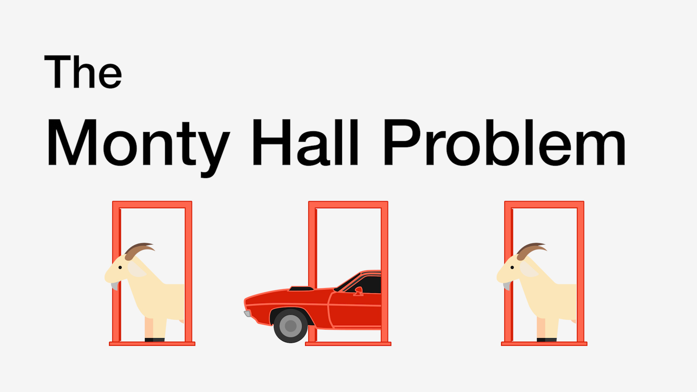

# Monty-Hall-Problem-Simulation



This simulation shows and generates a series of multiple Monty-Hall Games.
Simulation  Supports Switching doors and NOT switching doors also.

## Getting Started
Clone the directory to your desktop or any folder.
to clone this directory copy & paste in this your Terminal
```
git clone https://github.com/MohammedMahmud/RaspberryPi-Maintenance-Terminal-Tool.git
```

### Installing
##### Make sure you already have Python 3.7 or Above  
##### Make sure your javascript is enabled on your browser.
cd to your  Monty Hall directory

* Then Type 
```
python3 app.py 
```

## Built With -- Module

* [Python](https://www.python.org) - A high-level programming language
* [Flask](http://flask.pocoo.org/) - Flask is a micro web framework written in Python.


### New Update -- Soon 2019
* More Statistics Features
* Sharing Result In Social Media
* Exporting Functionality
* More Efficient Time To Run The Simulation

## Authors

* **Mohammed Mahmud** - *Initial work* - [Mohammed Mahmud](https://github.com/MohammedMahmud)

